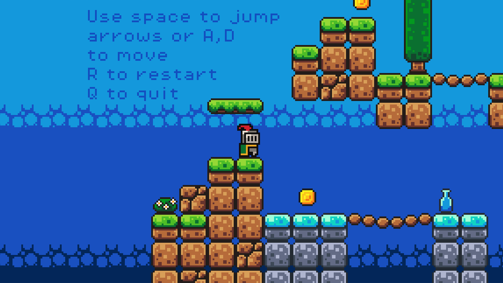

# BrickJumper

This game has been created following the youtube tutorial by Brackeys: [How to make a Video Game - Godot Beginner Tutorial - YouTube](https://www.youtube.com/watch?v=LOhfqjmasi0)

Many thanks for the wonderful and explicative tutorial!

## Play

You can play the game here: [BrickJumper](https://fillumina.github.io/brickjumper/). Enjoy!

## Assets

The used assed are those provided by Brackeys plus:

- fall.mp3 AI generated

- jump.mp3 (from [Free Jump Sound Effects Download - Pixabay](https://pixabay.com/sound-effects/search/jump/)), slightly edited

## Improvements

There are some small improvements:

- jump sound

- falling sound

- message to tell if the player has got all coins (YOU WIN!)

- quit game with Q

- restart game with R
